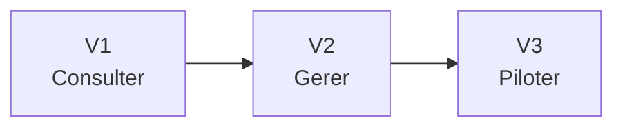

# Feuille de route du projet

Ce document sert de fil rouge pour suivre l'avancement du projet.

L'idee est simple :

- `V1` = remplacer le Google Site par une application utile au quotidien ;
- `V2` = ajouter la gestion des demandes et du suivi manager ;
- `V3` = ajouter les fonctions evoluees de pilotage terrain.

## Vision simple

### V1 - Consulter facilement

Objectif :

Mettre a disposition une vraie application web simple, claire et utilisable sur telephone, tablette et ordinateur.

### V2 - Gerer les demandes

Objectif :

Ajouter la partie gestion, en particulier autour des absences.

### V3 - Piloter le terrain

Objectif :

Transformer l'application en outil de pilotage terrain.

## Vision globale

## Tableau de suivi (etat au 1 avril 2026)

### V1

| Etape | Description | Statut |
|---|---|---|
| Cadrage | Comprendre l'existant et definir le perimetre | Fait |
| Specification MVP | Definir clairement ce qu'on met dans la V1 | Fait |
| Structure technique | Creer la base du projet | Fait |
| Module Planning | Afficher le planning | Fait |
| Module TG | Afficher les plans TG / GB | Fait |
| Module Plateau | Afficher les plans plateau + import PDF hebdo | Fait |
| Module Stats | Afficher les controles balisage | Fait |
| Module RH | Gestion RH (fiche, suivi, creation employe) | Fait |
| Tuile Google Agenda | Connexion OAuth + tuile dashboard | Fait |
| Module Infos (contenu) | Contenu metier a injecter | En attente donnees |
| Validation terrain | Verifier avec les vrais usages | Priorite immediate |
| Mise en ligne | Rendre l'application utilisable | A preparer apres recette |

### V2

| Etape | Description | Statut |
|---|---|---|
| Cadrage absences | Definir les regles de demande et validation | Fait |
| Formulaire absence | Saisie collaborateur | Fait |
| Suivi manager | Validation / refus / retour en attente | Fait |
| Historique | Voir les demandes passees | Fait |
| Integration planning | Repercuter les absences | Fait a consolider par recette |
| Stabilisation UX timeline | Lisibilite, legendes, filtres, echelle, scroll | Fait |
| PWA collaborateur | Login PIN, planning, absences, ecrans mobiles | Fait |
| Authentification collaborateur | Stabiliser le provisioning / mapping comptes | En cours |

### V3

| Etape | Description | Statut |
|---|---|---|
| Cadrage audit | Definir la grille de visite | A faire |
| Formulaire audit | Saisie terrain | A faire |
| Compte-rendu | Generer le rapport | A faire |
| Envoi collaborateur | Diffuser le resultat | A faire |
| Suivi des actions | Historique et relances | A faire |

## Outil de suivi recommande

Pour rester simple, on continue avec `GitHub Projects`.

Structure conseillee :

- colonne `Idees`
- colonne `A faire`
- colonne `En cours`
- colonne `En test`
- colonne `Valide`

Types de cartes a suivre en priorite immediate :

- `Validation terrain V1`
- `Corrections V1`
- `Mise en ligne V1`
- `Auth collaborateur`
- `Module Infos - donnees et structure`
- `Checklist exploitation (sauvegarde, securite, support)`

## Regle simple de pilotage

- on termine la validation V1 avant de basculer en V2 complet ;
- on evite d'ajouter du scope V3 tant que V1 n'est pas stabilisee ;
- chaque ticket doit avoir un critere d'acceptation testable.

## Prochaine etape

Les prochaines etapes logiques sont :

- executer une validation terrain courte (checklist) ;
- verifier le flux complet collaborateur en conditions reelles ;
- cadrer le contenu du module infos ;
- corriger puis preparer la mise en ligne (Netlify + runbook).
