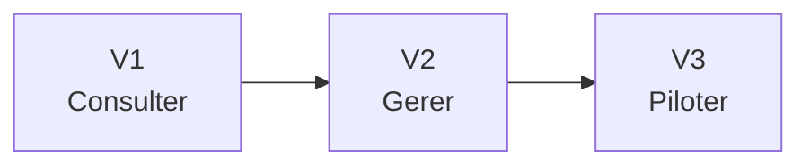
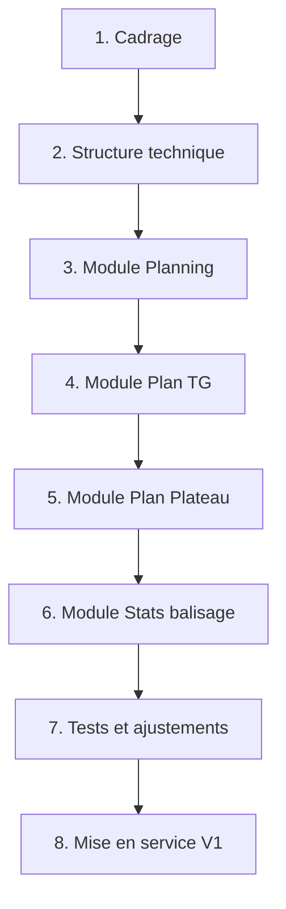

# Feuille de route du projet

Ce document sert de fil rouge pour suivre l'avancement du projet.

L'idee est simple :

- `V1` = remplacer le Google Site par une application utile au quotidien ;
- `V2` = ajouter la gestion des demandes et du suivi manager ;
- `V3` = ajouter les fonctions evoluees de pilotage terrain.

## Vision simple

### V1 - Consulter facilement

Objectif :

Mettre a disposition une vraie application web simple, claire et utilisable sur telephone, tablette et ordinateur.

Cette version doit deja rendre service au quotidien.

Contenu prevu :

- connexion simple ;
- page d'accueil ;
- consultation du planning ;
- consultation des plans TG ;
- consultation des plans plateau ;
- consultation des stats de balisage ;
- interface adaptee au mobile.

Ce qu'on ne cherche pas a faire tout de suite :

- workflow complet des absences ;
- audit terrain ;
- automatisations avancees ;
- exports complexes ;
- notifications poussees.

Definition de "V1 terminee" :

- la manager et les collaborateurs peuvent consulter les informations principales sans passer par le Google Site ;
- l'application est lisible et pratique sur smartphone ;
- les donnees principales existantes sont reprises proprement.

### V2 - Gerer les demandes

Objectif :

Ajouter la partie gestion, en particulier autour des absences.

Contenu prevu :

- formulaire de demande d'absence ;
- suivi des demandes ;
- validation ou refus par la manager ;
- historique des demandes ;
- integration de l'information dans le planning.

Definition de "V2 terminee" :

- les demandes d'absence ne passent plus par des outils disperses ;
- la manager a un suivi clair ;
- l'equipe comprend facilement l'etat des demandes.

### V3 - Piloter le terrain

Objectif :

Transformer l'application en outil de pilotage terrain.

Contenu prevu :

- formulaire d'audit terrain ;
- grille de controle avec champs predefinis ;
- generation d'un compte-rendu ;
- envoi aux collaborateurs concernes ;
- historique des visites ;
- suivi des actions correctives.

Definition de "V3 terminee" :

- les visites terrain sont suivies de facon structuree ;
- les comptes-rendus sont clairs et reutilisables ;
- la manager dispose d'un historique exploitable.

## Vision globale

## Decoupage simple de la V1

La `V1` est la priorite immediate.

Elle peut elle-meme etre construite par etapes.

## Tableau de suivi

### V1

| Etape | Description | Statut |
|---|---|---|
| Cadrage | Comprendre l'existant et definir le perimetre | Fait |
| Specification MVP | Definir clairement ce qu'on met dans la V1 | A faire |
| Structure technique | Creer la base du projet | A faire |
| Module Planning | Afficher le planning | A faire |
| Module TG | Afficher les plans TG / GB | A faire |
| Module Plateau | Afficher les plans plateau | A faire |
| Module Stats | Afficher les controles balisage | A faire |
| Validation terrain | Verifier avec les vrais usages | A faire |
| Mise en ligne | Rendre l'application utilisable | A faire |

### V2

| Etape | Description | Statut |
|---|---|---|
| Cadrage absences | Definir les regles de demande et validation | A faire |
| Formulaire absence | Saisie collaborateur | A faire |
| Suivi manager | Validation / refus | A faire |
| Historique | Voir les demandes passees | A faire |
| Integration planning | Repercuter les absences | A faire |

### V3

| Etape | Description | Statut |
|---|---|---|
| Cadrage audit | Definir la grille de visite | A faire |
| Formulaire audit | Saisie terrain | A faire |
| Compte-rendu | Generer le rapport | A faire |
| Envoi collaborateur | Diffuser le resultat | A faire |
| Suivi des actions | Historique et relances | A faire |

## Outil de suivi recommande

Pour rester simple, je recommande `GitHub Projects`.

Pourquoi :

- le depot est deja sur GitHub ;
- pas besoin d'ajouter un autre outil tout de suite ;
- on peut creer des colonnes simples du type `A faire`, `En cours`, `En validation`, `Termine` ;
- on peut relier chaque tache aux fichiers et au code.

Structure conseillee :

- colonne `Idees`
- colonne `A faire`
- colonne `En cours`
- colonne `En test`
- colonne `Valide`

Types de cartes a creer :

- `Spec V1`
- `Structure technique`
- `Planning`
- `Plan TG`
- `Plan Plateau`
- `Stats balisage`
- `Absences`
- `Audit terrain`

## Regle simple de pilotage

Pour eviter de se disperser :

- on termine la definition de la `V1` avant de coder massivement ;
- on valide chaque module avec un besoin concret ;
- on ne bascule vers `V2` que lorsque `V1` est vraiment utilisable ;
- on garde `V3` comme une evolution, pas comme une urgence.

## Prochaine etape

La prochaine etape logique est de rediger un document encore plus concret :

- les ecrans de la `V1` ;
- les utilisateurs ;
- les donnees a afficher ;
- ce qui est obligatoire ou optionnel ;
- l'ordre de developpement reel.
