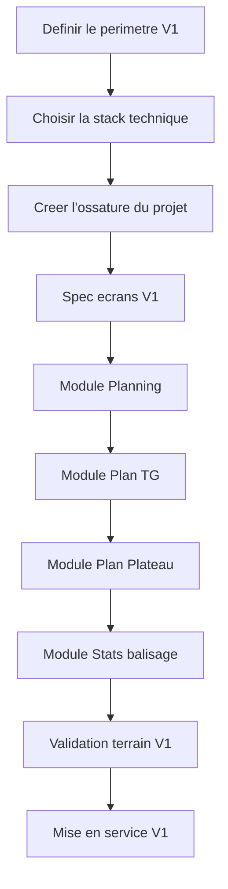

# Modele de tableau GitHub Projects

Ce document sert de modele pour creer un tableau de suivi simple dans GitHub Projects.

Le but est de savoir :

- ce qu'on doit faire ;
- ce qui est en cours ;
- ce qui est bloque ;
- ce qui est valide.

## Structure du tableau

Je recommande 5 colonnes :

### 1. Idees

Contient :

- les idees futures ;
- les evolutions non prioritaires ;
- les demandes a discuter plus tard.

### 2. A faire

Contient :

- les taches validees ;
- les prochaines etapes concretes ;
- ce qui est pret a etre demarre.

### 3. En cours

Contient :

- ce qu'on est en train de faire maintenant ;
- une seule grosse tache a la fois si possible.

### 4. En test

Contient :

- ce qui est developpe ou documente ;
- ce qui doit etre verifie ;
- ce qui doit etre relu ou valide metier.

### 5. Valide

Contient :

- ce qui est termine ;
- ce qui est approuve ;
- ce qui peut servir de base solide pour la suite.

## Regle simple d'utilisation

- une carte = un sujet clair ;
- on evite de mettre trop de cartes "En cours" en meme temps ;
- quand une etape est confirmee, on la passe en `Valide` ;
- ce qui n'est pas prioritaire reste dans `Idees`.

## Cartes a creer au depart

### Carte 1

Titre :

`Definir le perimetre V1`

Description :

Preciser clairement ce qui entre dans la premiere version utile de l'application et ce qui est reporte a plus tard.

Colonne de depart :

`A faire`

### Carte 2

Titre :

`Choisir la stack technique`

Description :

Valider les technologies qui serviront a construire l'application : interface, logique applicative, base de donnees, authentification, hebergement.

Colonne de depart :

`A faire`

### Carte 3

Titre :

`Creer l'ossature du projet`

Description :

Preparer la structure de base de l'application : projet, navigation, pages principales, base technique et organisation du code.

Colonne de depart :

`A faire`

### Carte 4

Titre :

`Spec ecrans V1`

Description :

Definir les ecrans de la V1, leur contenu, les utilisateurs cibles et l'ordre de priorite.

Colonne de depart :

`A faire`

### Carte 5

Titre :

`Module Planning`

Description :

Construire la partie planning pour les collaborateurs et la manager, avec affichage simple sur mobile et ordinateur.

Colonne de depart :

`A faire`

### Carte 6

Titre :

`Module Plan TG`

Description :

Construire la partie consultation des plans TG / GB avec filtres utiles.

Colonne de depart :

`A faire`

### Carte 7

Titre :

`Module Plan Plateau`

Description :

Construire la partie consultation des plans plateau et organiser l'acces par semaine ou par mois.

Colonne de depart :

`A faire`

### Carte 8

Titre :

`Module Stats balisage`

Description :

Construire la partie statistiques et suivi balisage avec vue simple et lisible.

Colonne de depart :

`A faire`

### Carte 9

Titre :

`Validation terrain V1`

Description :

Verifier avec les vrais besoins du magasin si la V1 couvre bien l'usage quotidien et relever les ajustements necessaires.

Colonne de depart :

`A faire`

### Carte 10

Titre :

`Mise en service V1`

Description :

Preparer la mise a disposition de la premiere version et sa verification finale.

Colonne de depart :

`A faire`

## Cartes a mettre dans Idees des le depart

### Carte idee 1

Titre :

`Workflow absences`

Description :

Saisie, validation et suivi des demandes d'absence.

Colonne de depart :

`Idees`

### Carte idee 2

Titre :

`Audit terrain`

Description :

Formulaire de visite terrain, compte-rendu, historique et suivi des actions.

Colonne de depart :

`Idees`

### Carte idee 3

Titre :

`Notifications`

Description :

Alerter les utilisateurs lors des mises a jour importantes, validations ou nouveaux comptes-rendus.

Colonne de depart :

`Idees`

### Carte idee 4

Titre :

`Exports avances`

Description :

Produire des comptes-rendus, PDFs ou exports plus complets.

Colonne de depart :

`Idees`

## Ordre logique de progression

## Conseils pratiques

- ne pas essayer de lancer `V2` ou `V3` tant que `V1` n'est pas solide ;
- garder les idees, mais ne pas les melanger avec les priorites ;
- valider les modules un par un ;
- utiliser le tableau comme support de discussion, pas comme usine a gaz.

## Premiere utilisation recommande

Quand tu crees le tableau GitHub Projects :

1. cree les 5 colonnes ;
2. ajoute les cartes de la section `A faire` ;
3. ajoute les cartes de la section `Idees` ;
4. place `Definir le perimetre V1` en premiere priorite ;
5. ne passe qu'une seule grande carte a la fois en `En cours`.
